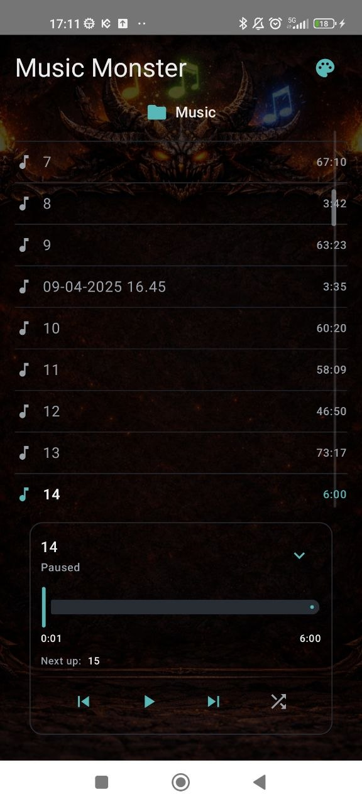
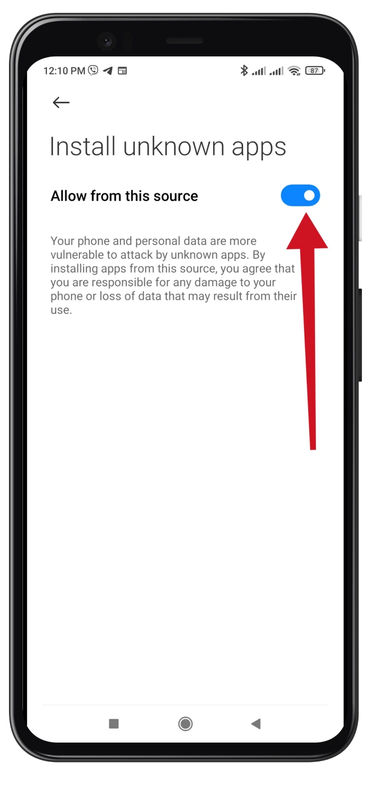

# 🎵 Music Monster

An **ad-free, offline music player** for Android. It plays the audio files you already own, with a clean, smooth, immersive interface — no ads, no accounts, no tracking, nothing leaving your device.

> **Free.** No paywall, no subscriptions.

<!-- Hero shot — one nice screenshot of the player sells the whole app.
     Put the PNG in a docs/ folder in this repo, then this renders on the front page: -->

  

## ⬇️ Download & install (no Play Store needed)

1. **Download the latest APK** → **[Releases](../../releases/latest)**
2. Open the downloaded `.apk` on your phone.
3. If Android asks, allow **"Install unknown apps"** for the app you downloaded with (Settings → Apps → *your browser / file manager* → *Install unknown apps* → allow).

   

4. Tap **Install**. If **Play Protect** shows a warning, choose **Install anyway** — that's normal for apps installed outside the Play Store.
5. Grant access to your audio when asked, and enjoy. 🎧

*Requires Android 7.0 or newer (minSdk 24).*

## ✨ What makes it nice

- Plays your **local audio** — common formats via Media3/ExoPlayer (MP3, M4A/AAC, FLAC, OGG, WAV…)
- **Completely ad-free and offline** — no tracking, no network needed
- **Background playback** with notification controls, keeps playing while you use other apps
- Clean, fluid, **distraction-free** interface built to feel good to use

<!-- Show, don't tell — a couple of in-app shots at the key screens:

  
  

-->

## 🔄 Updates

New versions appear under **[Releases](../../releases)** — just download the newest APK and install over the old one (it updates in place, your library stays).

## ℹ️ About

This is the public download page for Music Monster — a personal project, released free. Bug reports and feedback are welcome via the **Issues** tab.
